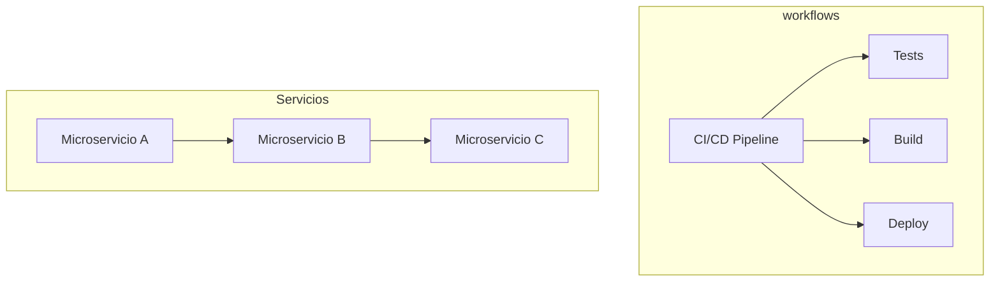

# Diagrama del proyecto

```mermaid
graph TB
    subgraph "workflows"
        D[CI/CD Pipeline] --> E[Tests]
        D --> F[Build]
        D --> G[Deploy]
    end
    
    subgraph "Servicios"
        A[Microservicio A] --> B[Microservicio B]
        B --> C[Microservicio C]
    end
```
